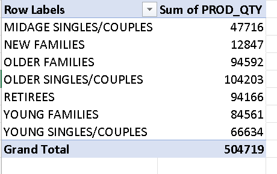
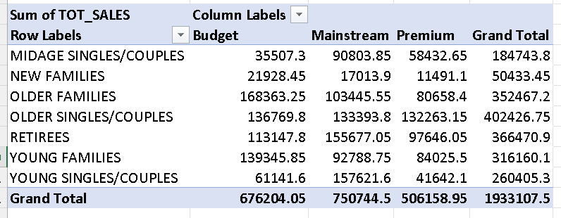
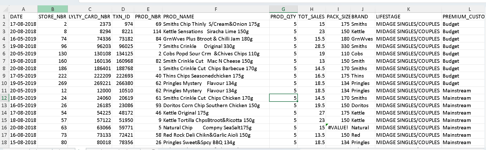
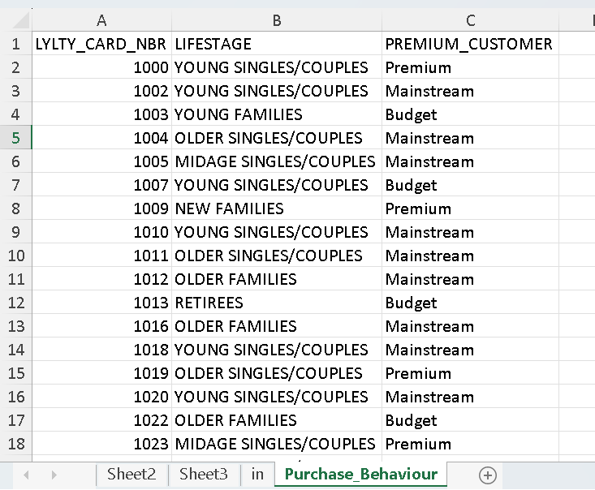

# 📊 Customer Purchase Behaviour Analysis using Microsoft Excel

## 📌 Project Overview

This project analyzes retail customer purchasing behavior using Microsoft Excel. The analysis focuses on customer life stages and premium customer segments to identify purchasing patterns, sales performance, and business opportunities using Pivot Tables and Pivot Charts.

---

## 🎯 Objectives

- Analyze customer purchasing behavior.
- Compare Budget, Mainstream, and Premium customer segments.
- Identify high-value customer groups.
- Generate business insights from retail sales data.
- Support data-driven business decisions.

---

## 🛠️ Tools & Technologies

- Microsoft Excel
- Pivot Tables
- Pivot Charts
- Data Cleaning
- Data Analysis

---

## 📂 Dataset

The project uses three datasets:

- **QVI_transaction_data.xlsx** – Retail transaction data
- **QVI_purchase_behaviour.csv** – Customer demographic and segmentation data
- **QVI_data.csv** – Processed dataset used for analysis

---

## 📈 Analysis Performed

- Customer Segmentation Analysis
- Sales Analysis by Life Stage
- Sales Analysis by Premium Customer Category
- Product Quantity Analysis
- Pivot Table Reporting
- Business Insight Generation

---

## 📊 Key Insights

- Older Singles/Couples generated the highest total sales.
- Mainstream customers contributed the highest overall revenue.
- Premium customers showed strong spending in several life stages.
- New Families generated the lowest total sales.
- Customer purchasing behavior differs significantly across life stages.

---

## 💡 Business Recommendations

- Focus marketing campaigns on high-value customer segments.
- Increase personalized offers for Premium customers.
- Improve engagement strategies for lower-performing customer groups.
- Use customer segmentation for better marketing and inventory planning.

---

## 📁 Repository Structure

```
customer-purchase-behaviour-analysis-excel
│
├── Dashboard
│   └── Customer_Purchase_Behaviour_Dashboard.xlsx
│
├── Dataset
│   ├── QVI_data.csv
│   ├── QVI_purchase_behaviour.csv
│   └── QVI_transaction_data.xlsx
│
├── Images
│   ├── customer-purchase-behaviour-data.png
│   ├── raw-customer-purchase-data.png
│   ├── total-product-quantity-by-life-stage.png
│   └── sales-by-life-stage-and-customer-segment.png
│
└── README.md
```

---

## 📷 Project Preview

### Customer Purchase Behaviour Dataset



---

### Raw Customer Purchase Dataset



---

### Total Product Quantity by Customer Life Stage



---

### Sales by Life Stage and Customer Segment



---

## 👨‍💻 Author

**Sandeep Kumar Tiwari**

- GitHub: https://github.com/thesandeeptiwari
- LinkedIn: https://www.linkedin.com/in/mrsandeeptiwari
- Portfolio: https://www.sandeeptiwari.site
